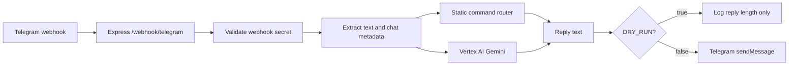

# Architecture

## Overview

Bogush Studio AI Router Kit is a single Node.js service designed for Cloud Run.
It receives Telegram webhook updates, validates optional Telegram webhook
secrets, generates a reply with Vertex AI Gemini, and sends the response back to
Telegram only when `DRY_RUN=false`.

## Request Flow

## Safety Defaults

- `DRY_RUN=true` by default.
- Raw chat IDs are not logged; a short SHA-256 hash is logged instead.
- Telegram messages are not sent unless explicitly enabled.
- Webhook setup helper does not call Telegram unless explicitly confirmed.
- Deploy helper requires project, service, and service account parameters.

## Main Modules

- `src/server.js`: Express app, webhook route, command router, Gemini call, and
  Telegram send logic.
- `scripts/*.mjs`: local tests for webhook behavior, logging privacy, command
  replies, prompt policy, and failure paths.
- `scripts/*.ps1`: guarded helper scripts for deployment and webhook setup.

## Production Boundary

This repository is a template. Production operators must provide their own:

- Google Cloud project
- Cloud Run service
- service account
- Secret Manager values
- Telegram bot token
- Telegram webhook secret

